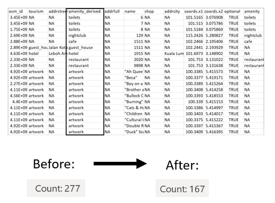
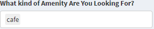
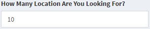
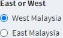
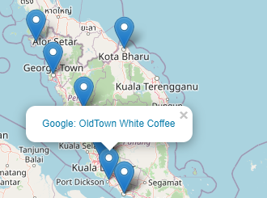
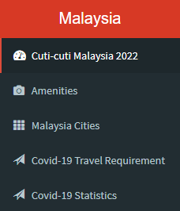

## Research Problem, Question and Audience Dataset

Research Problem:The outbreak of COVID-19 pandemic has take a considerable toll on Malaysia domestic tourism. There is a need to revitalise the domestic tourism in Malaysia.

Research Question: How to provide convenience for demestic travellors to plan on travel route and to stimulate their interest on domestic travel 

Audience: Family Vacationers,Friends’ Getaway Travelers, Natural Quality Seekers, Travel Agency

Dataset:https://data.world/hot/8245e8d7-f895-4252-a0bc-7578423e22ea/workspace/file?filename=hotosm_mys_points_of_interest_points.dbf <-dataset

---
## Data Preprocessing
1. Read shapefile in R
2. Convert osm id into latitude and longitude
3. Identify West and East Malaysia based on latitude & longitude
4. Clean data in amenity_derived column

---

## How is the Shiny Interaction Designed?

With the many factors that could enhanced user experience on amenity search, we have extracted and derived three composing factors from the available dataset

i.  What is the location's amenity?

ii. How  many location needs to be listed?

iii. Is the location East or West of Malaysia?

,

---

## Google Extended Search Function
The pinpointed location are displayed on an OpenStreetMap (OSM) with the application of leaflet package available in R.

By clicking on the link from the pinpointed location, user may also further research the displayed location with Google Search Engine.

---

## Intended Design of Dashboard Interface
To accomodate user on their travel experience in Malaysia during the year 2022, the following additional travelling information and guidelines were provided:

1. Promotion Video on Country's Travel Program "Cuti-cuti Malaysia 2022"
2. Location of Malaysia's State Cities
3. Covid-19 Travel Requirement
4. Covid-19 Statistics

